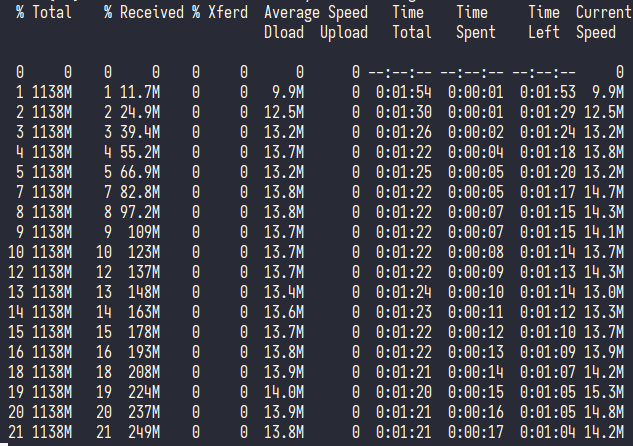
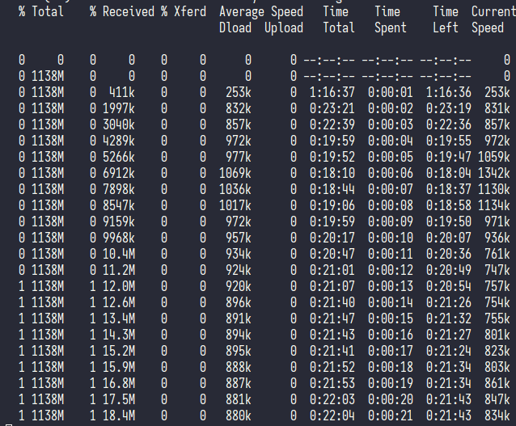
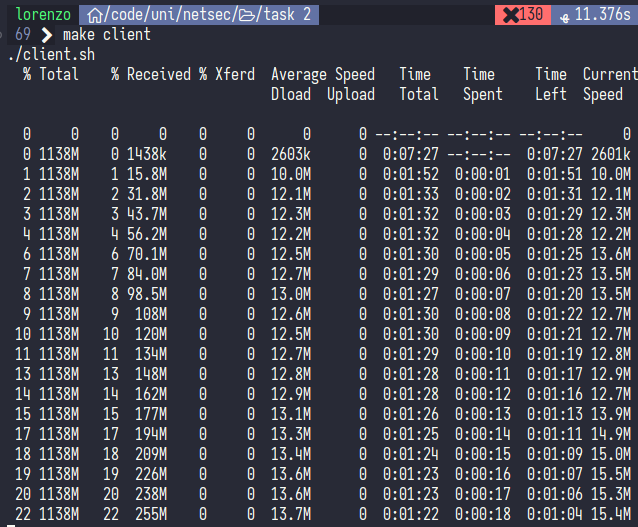
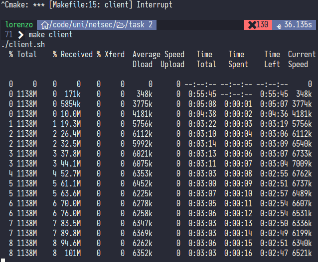

1. You should have three devices that can see each other's traffic. The *server*, the *client* and the *attacker*.
1. Clone this project to the client device
1. Clone this project to the attacker device
1. Install an FTP server on a third device. We used an android app called ["primitive ftp"]().
1. Set username and password on server. We used `admin admin`.
1. Run `make genfile` to generate a dummy file called `bigfile.dat` to send over FTP
1. Move the file to the root of the FTP tree
1. Set the ports used by the FTP server. We used `12345` for the protocol and `5678` for the "passive port".
1. Take note of each devices IP addresses (you can log into your wifi router's admin console and see all connected devices)
1. Put all these configurations in the `config.json` file on the client and server devices (username, password, ports, etc...)
1. On the client, run `make client` to run the client, it should start downloading the file repeatedly, reporting the download speed in real time.
1. Make note of the baseline speed
1. In `config.json`, set the `mode` to `ACK` to perform an ACK-flood attack
1. On the attacker, run `make attack` to run the attack. You should see the download speed drop considerably.
1. In `config.json`, set the `mode` to `RST` to perform an RST-flood attack
1. On the attacker, run `make attack` again, now it will run the RST-flood attack instead. Make note of the download speed.

healthy:

ACK flood:

healthy:

RST flood:
